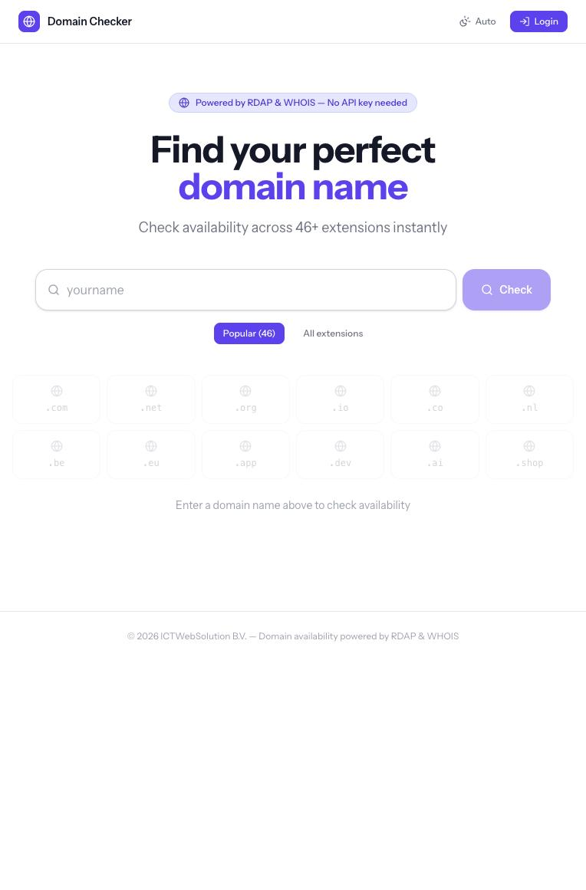
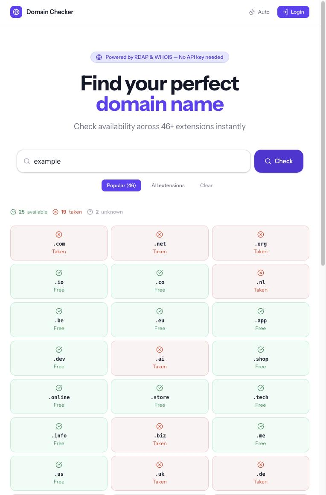
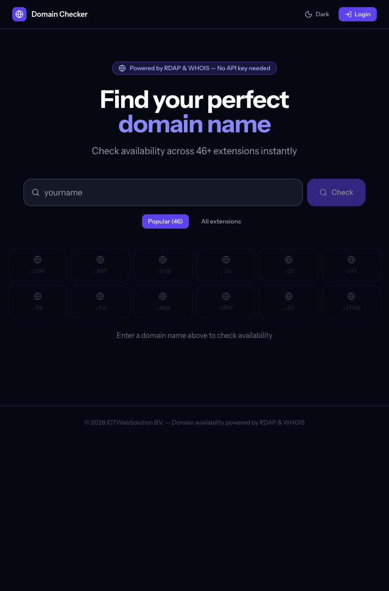
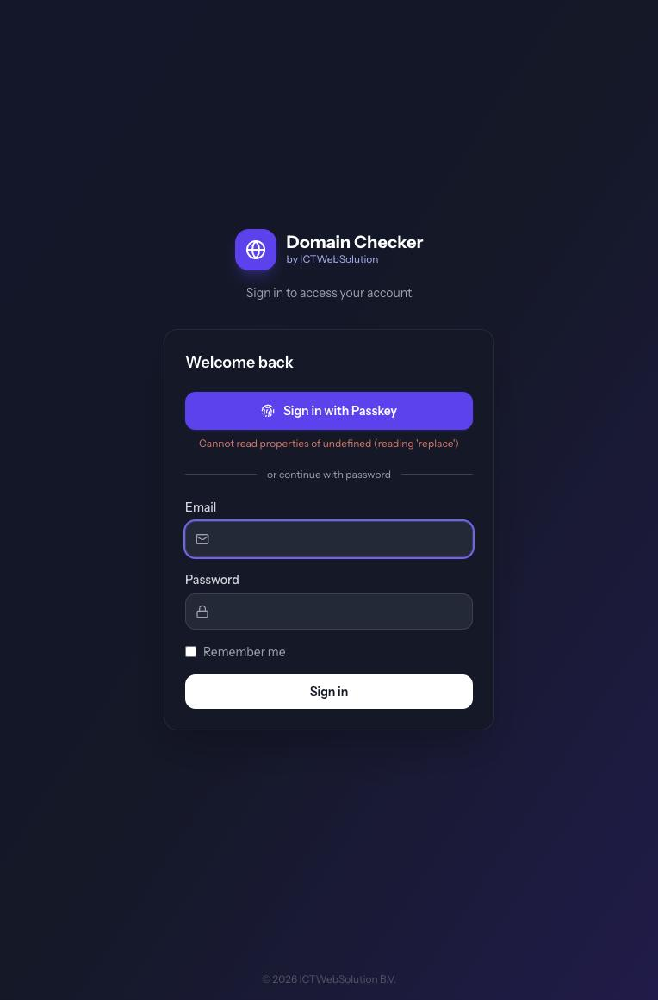
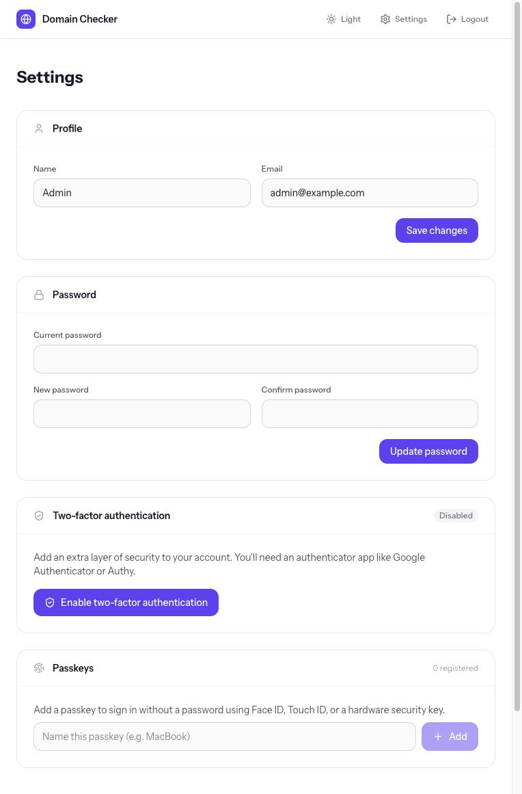

# Domain Checker

[](CHANGELOG.md)
[](https://laravel.com)
[](https://vuejs.org)
[](https://tailwindcss.com)
[](https://opensource.org/licenses/MIT)

A fast, public domain availability checker built with Laravel and Vue.js. Check a name across 46 popular extensions (or the full IANA list of 1,200+) in real time — results stream in one by one via Server-Sent Events. Supports optional [Realtime Register IsProxy](#realtime-register-isproxy) for faster, parallel lookups with a free RDAP/WHOIS fallback.

> **Disclaimer:** This software is provided "as is", without warranty of any kind. Use at your own risk. The authors are not responsible for any data loss, security breaches, or other damages resulting from the use of this software. Always review the code and configure proper security measures before deploying to production.

---

## Screenshots

<p align="center">
  
  &nbsp;
  
</p>

<p align="center">
  
  &nbsp;
  
</p>

<p align="center">
  
</p>

---

## Features

### Domain checking
- **46 popular TLDs** checked by default — `.nl`, `.com`, `.be`, `.de`, `.net`, `.org`, `.io`, `.co`, `.eu`, `.app`, `.dev`, `.ai`, and more.
- **Full IANA TLD list** — expand to 1,200+ extensions with one click; list is fetched from IANA and cached daily.
- **Realtime Register IsProxy** (optional) — socket-based parallel lookups over a single persistent TLS connection. All IS commands are sent at once and responses stream back as the server resolves them, making total check time ≈ slowest single TLD regardless of list size.
- **RDAP-first lookup** — free fallback using the [IANA RDAP bootstrap](https://data.iana.org/rdap/dns.json). HTTP 404 = available, 200 = taken.
- **WHOIS fallback** — for TLDs without RDAP, a PHP socket queries the authoritative WHOIS server with text-pattern parsing.
- **Real-time streaming** — results appear one by one via Server-Sent Events.
- **Result caching** — per-domain results cached 15 min; RDAP bootstrap and IANA list cached 24 h.

### Smart input
- Accepts plain names (`example`), full domains (`example.nl`), or URLs (`https://www.example.nl`).
- Auto-checks when a full domain is typed or pasted (400 ms debounce).
- Pins the explicitly typed TLD to the top of the results.
- Auto-selects the pinned TLD if it comes back available.

### Selection & clipboard
- Checkbox-select any available domains.
- **Select all available** with one click.
- Sticky clipboard bar slides up showing selected count + "Copy to clipboard" — copies all selected full domain names (one per line) for easy pasting in email or WhatsApp.

### User management
- **Multi-user support** — admin panel at `/admin/users` to create, edit, and delete user accounts.
- **Three-tier roles** — `user`, `admin`, `super_admin`. Regular admins can manage users and send invites; only super admins can assign the `super_admin` role.
- **Email invite flow** — send an invite link with configurable expiry. Invitees set their name and password; they are automatically logged in on acceptance.
- **Password reset** — admins can trigger password reset emails per user; users can also self-serve via "Forgot password?" on the login page.
- **2FA reset** — admins can clear a user's TOTP secret and passkeys from the panel.

### Authentication & security
- Public checker — no login required.
- Rate-limited: 10 checks/min for guests, 60/min for authenticated users.
- Login via **WebAuthn passkey** or email + password.
- **TOTP two-factor authentication** with QR setup and 8 recovery codes.
- Settings page: profile, password, 2FA, and passkey management.

### UI
- Light / Dark / Auto theme (no flash on load).
- Subtle dot-grid background pattern.
- Fully responsive — 3-column list on desktop, single column on mobile.

---

## Installation

### Requirements

- PHP 8.4+
- Composer
- Node.js 20+
- MySQL 8.0+ / PostgreSQL 14+ / SQLite

### Local development

```bash
# Clone the repository
git clone https://github.com/ICTWebSolutionBV/domain-checker.git
cd domain-checker

# Install PHP dependencies
composer install

# Install Node dependencies
npm install

# Copy environment file and generate key
cp .env.example .env
php artisan key:generate

# Configure your database in .env, then run migrations
php artisan migrate

# Create the first super admin user
php artisan tinker
>>> \App\Models\User::create([
...     'first_name' => 'Your',
...     'last_name'  => 'Name',
...     'name'       => 'Your Name',
...     'email'      => 'admin@example.com',
...     'password'   => bcrypt('your-password'),
...     'role'       => 'super_admin',
... ]);

# Build frontend assets
npm run build

# Start development servers
php artisan serve
npm run dev
```

---

## Deploying with Ploi

### 1. Create a new site

- In Ploi, create a new site pointing to your domain.
- Set the **web directory** to `/public`.
- Select **PHP 8.4+**.

### 2. Connect repository

- Go to your site's **Repository** tab.
- Connect to `github.com/ICTWebSolutionBV/domain-checker`.
- Set branch to `main`.
- Enable **Install Composer dependencies**.

### 3. Deploy script

Replace the default deploy script with:

```bash
cd {SITE_DIRECTORY}
git pull origin main

# Ensure required directories exist and are writable (must run before composer/npm)
mkdir -p bootstrap/cache
mkdir -p storage/framework/cache/data
mkdir -p storage/framework/sessions
mkdir -p storage/framework/views
mkdir -p storage/logs
chmod -R 777 storage      # 777 so both the deploy user and PHP-FPM user can write
chmod -R 775 bootstrap/cache

# Clear any stale compiled files so PHP can write fresh ones during the build
php artisan optimize:clear

composer install --no-interaction --prefer-dist --optimize-autoloader --no-dev

npm ci
npm run build

php artisan migrate --force
php artisan config:cache
php artisan route:cache
# view:cache is intentionally omitted — views compile on first request,
# and view:cache requires storage/framework/views to be writable by the
# PHP-FPM user which may differ from the deploy user on some Ploi setups.
php artisan storage:link

echo "Application deployed!"
```

### 4. Environment variables

In the **Environment** tab, set your `.env`:

```env
APP_NAME="Domain Checker"
APP_ENV=production
APP_DEBUG=false
APP_URL=https://your-domain.com

DB_CONNECTION=mysql
DB_HOST=127.0.0.1
DB_PORT=3306
DB_DATABASE=domain_checker
DB_USERNAME=your_db_user
DB_PASSWORD=your_db_password

SESSION_DRIVER=database
CACHE_STORE=database
QUEUE_CONNECTION=database

MAIL_MAILER=smtp
MAIL_HOST=your-smtp-host
MAIL_PORT=587
MAIL_USERNAME=your-smtp-user
MAIL_PASSWORD=your-smtp-password
MAIL_FROM_ADDRESS=noreply@your-domain.com
MAIL_FROM_NAME="${APP_NAME}"
```

### 5. First super admin user

After the first deploy, create your super admin via the Ploi console or SSH:

```bash
cd {SITE_DIRECTORY}
php artisan tinker
>>> \App\Models\User::create([
...     'first_name' => 'Your',
...     'last_name'  => 'Name',
...     'name'       => 'Your Name',
...     'email'      => 'you@example.com',
...     'password'   => bcrypt('your-password'),
...     'role'       => 'super_admin',
... ]);
```

Then log in at `https://your-domain.com/login` and register a passkey or enable 2FA from Settings.

To promote an existing user to super admin:

```bash
php artisan tinker
>>> \App\Models\User::where('email', 'you@example.com')->update(['role' => 'super_admin']);
```

---

## User management

The admin panel is available at `/admin/users` for any user with the `admin` or `super_admin` role.

### Roles

| Role | Can do |
|---|---|
| `user` | Use the domain checker, manage own profile and passkeys |
| `admin` | Everything above + manage users, send invites, reset passwords and 2FA |
| `super_admin` | Everything above + assign/revoke `super_admin` role, delete super admins |

### Creating users

Two ways to add a user:

1. **Invite** — click the **Invite** button, fill in the email (and optionally name + role + expiry), and click **Send Invite**. The invitee receives an email with a link to set their own password. The link expires after the configured number of hours.

2. **Direct create** — click **Create User**, fill in name, email, password, and role. The account is created immediately; no email is sent.

### Managing existing users

From the users table you can:

- **Edit** — change name, email, or role.
- **Send password reset** — triggers a standard Laravel password reset email.
- **Reset 2FA** — clears the user's TOTP secret and all registered passkeys. They will need to re-enroll on next sign-in.
- **Delete** — permanently removes the account. You cannot delete your own account; only super admins can delete other super admins.

### Pending invites

Invites that have been sent but not yet accepted appear in the **Pending Invites** table below the users list. Each invite shows the invitee email, role, who sent it, and its current status (Pending / Expired). You can **Revoke** a valid invite or **Resend** an expired one with a fresh 72-hour expiry.

---

## Realtime Register IsProxy

[Realtime Register](https://www.realtimeregister.com) offers an IsProxy API for fast parallel domain availability lookups over a single TLS socket connection. When configured, it is used as the primary check source with RDAP/WHOIS as fallback.

### How it works

1. A single TCP connection is opened to `is.yoursrs.com:2001`.
2. STARTTLS is negotiated and the connection is upgraded to TLS.
3. The client logs in with `LOGIN <api_key>`.
4. All `IS <domain>.<tld>` commands are sent in one batch without waiting for responses.
5. The server processes them in parallel and sends back async responses.
6. Each result is streamed to the browser immediately via SSE as it arrives.

This makes total check time ≈ slowest single TLD lookup, regardless of how many TLDs are being checked.

### Configuration

Add the API key in **Settings → API Integrations** after logging in. Optionally override the host:

```env
REALTIME_REGISTER_API_KEY=your-api-key
REALTIME_REGISTER_HOST=is.yoursrs.com   # default
REALTIME_REGISTER_PORT=2001             # default
```

The key requires **IsProxy** access. RDAP and WHOIS are used automatically for any TLD the IsProxy service cannot resolve.

---

## Environment variables

### Application

| Variable | Default | What it does |
|---|---|---|
| `APP_NAME` | `Laravel` | Shown in the browser tab and emails. |
| `APP_ENV` | `local` | Set to `production` when deploying. |
| `APP_KEY` | _(required)_ | Generated by `php artisan key:generate`. Encrypts sessions and 2FA secrets. Never rotate without a plan. |
| `APP_DEBUG` | `true` | Set to `false` in production. |
| `APP_URL` | `http://localhost` | Base URL of the app. Used for passkey WebAuthn origin checks. |

### Database

| Variable | Default | What it does |
|---|---|---|
| `DB_CONNECTION` | `sqlite` | `sqlite`, `mysql`, `pgsql`. |
| `DB_HOST` | `127.0.0.1` | Database server host (not used for SQLite). |
| `DB_DATABASE` | _(sqlite file)_ | Database name or SQLite file path. |
| `DB_USERNAME` / `DB_PASSWORD` | empty | Database credentials. |

### Mail

| Variable | Default | What it does |
|---|---|---|
| `MAIL_MAILER` | `log` | Set to `smtp` (or `ses`, `mailgun`, etc.) in production. |
| `MAIL_HOST` | `127.0.0.1` | SMTP host. |
| `MAIL_PORT` | `2525` | SMTP port. |
| `MAIL_USERNAME` / `MAIL_PASSWORD` | empty | SMTP credentials. |
| `MAIL_FROM_ADDRESS` | `hello@example.com` | From address for all outgoing mail (invites, password resets). |
| `MAIL_FROM_NAME` | `${APP_NAME}` | From name for all outgoing mail. |

### Session & cache

| Variable | Default | What it does |
|---|---|---|
| `SESSION_DRIVER` | `database` | Use `database` or `redis`. |
| `SESSION_LIFETIME` | `120` | Idle session timeout in minutes. |
| `CACHE_STORE` | `database` | Used to cache RDAP bootstrap, TLD list, and domain results. |

### Realtime Register

| Variable | Default | What it does |
|---|---|---|
| `REALTIME_REGISTER_API_KEY` | empty | IsProxy API key. Leave empty to use RDAP/WHOIS only. |
| `REALTIME_REGISTER_HOST` | `is.yoursrs.com` | IsProxy hostname. |
| `REALTIME_REGISTER_PORT` | `2001` | IsProxy port. |

### Rate limiting

The domain-check endpoint uses Laravel's named rate limiter `domain-check`: 10 requests/min for guests, 60/min for authenticated users. Adjust in `AppServiceProvider` if needed.

---

## Versioning

Domain Checker follows [Semantic Versioning](https://semver.org/). The current release is **v1.5.1**. All changes are tracked in [CHANGELOG.md](CHANGELOG.md):

- **1.5.1** — HTTP/3 panel now shows a QUIC session strip (Connection ID, Packet RX, Handshake Done) and a cleaner HTTP Version / Status Code / Response Time summary, plus a Header/Value response-headers table.
- **1.5.0** — HTTP/3 checker now returns full server info: HTTP version, status, DNS / connect / TLS / TTFB / total timings, server IP, and all response headers. When curl has QUIC built in, the panel shows data observed over HTTP/3.
- **1.4.1** — IP Lookup history moved to browser-local storage with a 7-day expiry (no longer stored or shared on the server).
- **1.4.0** — IP Lookup page with geolocation, ASN, reverse DNS, and proxy/hosting signals via ip-api.com.
- **1.3.0** — HTTP/3 checker page with real-time SSE streaming (DNS, TLS 1.3, HTTP/2, Alt-Svc, QUIC).

- **Patch (`1.0.x`)** — Bug fixes and small tweaks.
- **Minor (`1.x.0`)** — New features, backwards-compatible.
- **Major (`x.0.0`)** — Breaking changes requiring manual intervention.

---

## License

MIT — see [LICENSE](LICENSE) for details.
