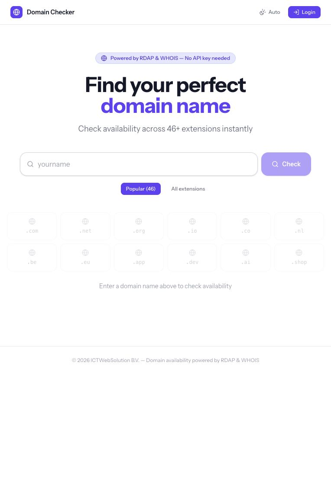
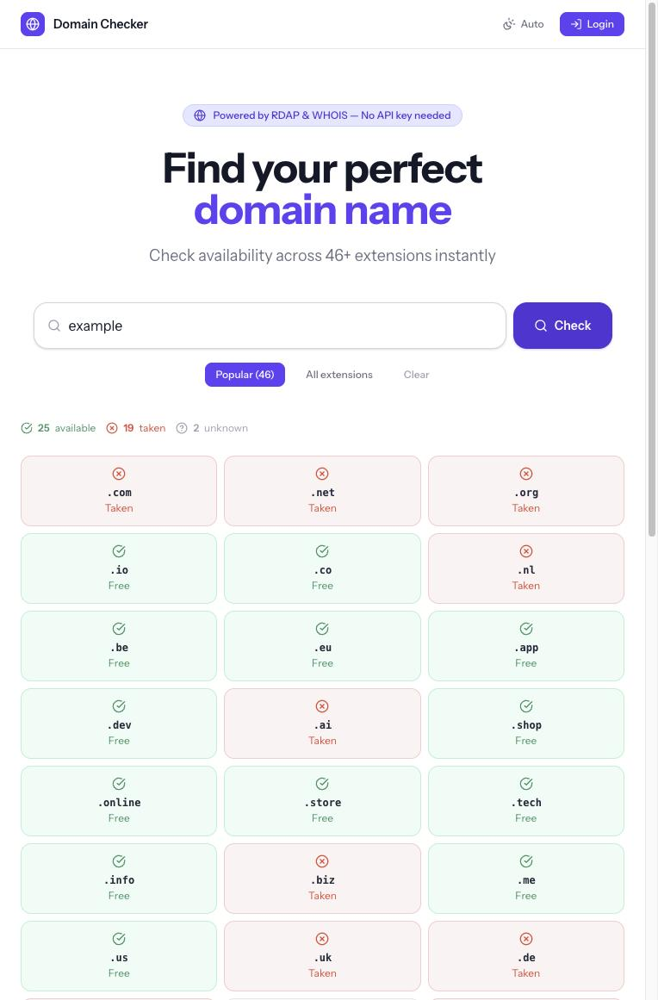
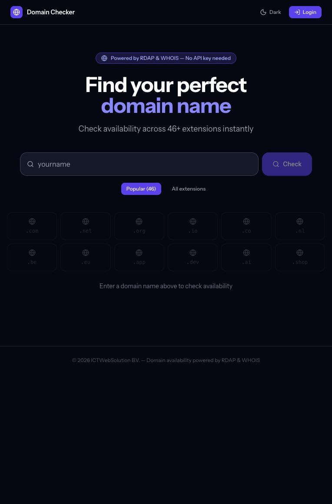
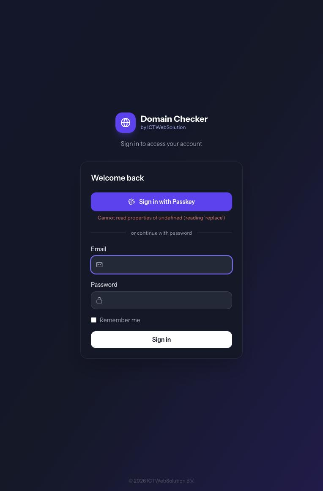
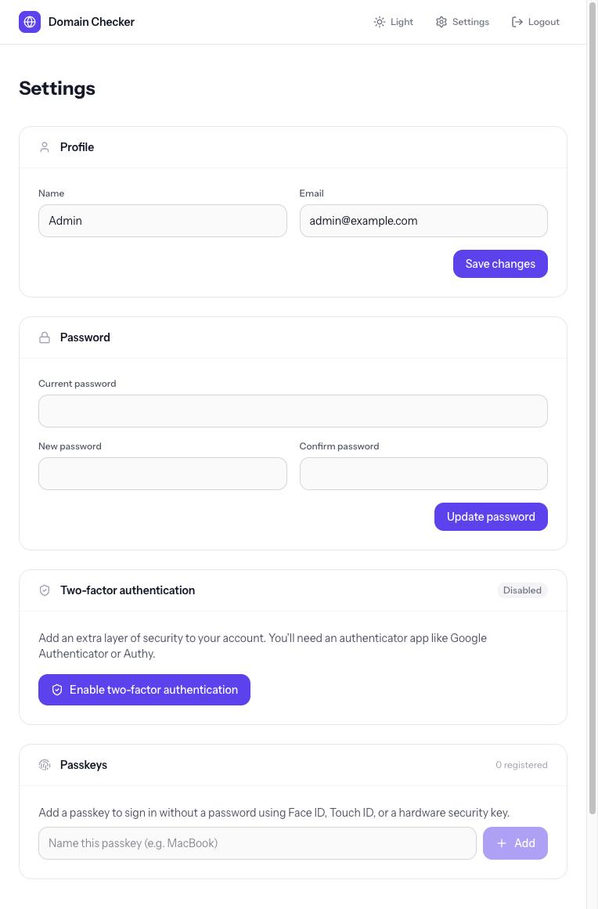

# Domain Checker

[](CHANGELOG.md)
[](https://laravel.com)
[](https://vuejs.org)
[](https://tailwindcss.com)
[](https://opensource.org/licenses/MIT)

A public domain toolbox built with Laravel and Vue.js. Check a name across 46 popular extensions (or the full IANA list of 1,200+) in real time — results stream in one by one via Server-Sent Events — and alongside it, check bulk lists, HTTP/3 support, redirect chains, DNS records for up to 100 domains at once, and IP geolocation. Supports optional [Realtime Register IsProxy](#realtime-register-isproxy) for faster, parallel lookups with a free RDAP/WHOIS fallback.

> **Disclaimer:** This software is provided "as is", without warranty of any kind. Use at your own risk. The authors are not responsible for any data loss, security breaches, or other damages resulting from the use of this software. Always review the code and configure proper security measures before deploying to production.

---

## Screenshots

<p align="center">
  
  &nbsp;
  
</p>

<p align="center">
  
  &nbsp;
  
</p>

<p align="center">
  
</p>

> All five were captured on 2026-04-20, the first release day, and have never
> been retaken. Everything except `home-dark` shows the light theme as it was
> before the v1.11.0 design pass; none of them show the extra tools, the
> bulk-check toggle or the registration modal, and the Settings shot predates
> the API Integrations card by a day. They need re-capturing at v1.11.1.

---

## Features

### Domain checking
- **46 popular TLDs** checked by default — `.nl`, `.com`, `.be`, `.de`, `.net`, `.org`, `.io`, `.co`, `.eu`, `.app`, `.dev`, `.ai`, and more.
- **Full IANA TLD list** — expand to 1,200+ extensions with one click; list is fetched from IANA and cached daily.
- **Realtime Register IsProxy** (optional) — socket-based parallel lookups over a single persistent TLS connection. All IS commands are sent at once and responses stream back as the server resolves them, making total check time ≈ slowest single TLD regardless of list size.
- **RDAP-first lookup** — free fallback using the [IANA RDAP bootstrap](https://data.iana.org/rdap/dns.json). HTTP 404 = available, 200 = taken.
- **WHOIS fallback** — for TLDs without RDAP, a PHP socket queries the authoritative WHOIS server with text-pattern parsing.
- **Real-time streaming** — results appear one by one via Server-Sent Events.
- **Result caching** — per-domain results cached 15 min; RDAP bootstrap and IANA list cached 24 h. An `unknown` verdict is cached for 60 s only, because it is a non-answer rather than a result.

### Tools

Seven pages ship in the navigation, plus a bulk mode on the checker itself.
All of them are public, and every endpoint that does outbound work is
rate-limited:

| Tool | Route | What it does |
|---|---|---|
| Domain checker | `/` | The default: one name across 46 popular TLDs or the full IANA list, streamed over SSE. |
| Bulk check | `/` (mode toggle) | Paste a list of full domains and check them all at once. Each line is split on the longest known TLD suffix, so `blog.google.com` is read as the domain it is. |
| HTTP/3 checker | `/http3` | Streams a live probe of DNS, TLS 1.3, HTTP/2, `Alt-Svc` and QUIC, with server info, per-phase timings and all response headers. |
| Redirect checker | `/redirect` | Traces the full redirect chain of a URL — each hop with its status code, `Location` header and timing — with selectable user agents. Hard-capped at 20 hops and a 15 s timeout. |
| Bulk DNS lookup | `/dns` | MX, NS, TXT, A, AAAA or CNAME for up to 100 domains at once, with optional IP geolocation columns and Copy as TSV. |
| IP lookup | `/ip` | Geolocation, ASN, reverse DNS and proxy/hosting signals for any IP, with 7-day browser-local history. |
| My IP | `/my-ip` | Shows the visitor their own address. |
| Transfer request | `/transfer` | Builds a formatted transfer request across several registrant groups. Nothing is submitted: the result goes to the clipboard. |

Every outbound probe goes through `PublicNetworkGuard`, which resolves the
target host first and refuses loopback, link-local, RFC1918, CGNAT and the
other reserved ranges, so these tools cannot be pointed at internal hosts.

### Smart input
- Accepts plain names (`example`), full domains (`example.nl`), or URLs (`https://www.example.nl`).
- Auto-checks when a full domain is typed or pasted (400 ms debounce).
- The explicitly typed extension is always checked and answered first, as a headline result card above the grid — even when that TLD is not in the selected list.
- Auto-selects the pinned TLD if it comes back available.

### Selection & ordering
- Checkbox-select any available domains (the single and bulk result lists each have their own **Select all available**).
- A sticky bar slides up with the selected count and a **Fill in details and request** button.
- That opens the registration modal — contact, address and business fields, all required — with a collapsible "How does this work?" explainer.
- **Copy to clipboard** in the modal footer puts a formatted summary (the domains plus the registration details) on the clipboard. Nothing is submitted to the server.

### User management
- **Multi-user support** — admin panel at `/admin/users` to create, edit, and delete user accounts.
- **Three-tier roles** — `user`, `admin`, `super_admin`. Regular admins can manage users and send invites; only super admins can assign the `super_admin` role.
- **Email invite flow** — send an invite link with configurable expiry. Invitees set their name and password; they are automatically logged in on acceptance.
- **Password reset** — admins can trigger password reset emails per user; users can also self-serve via "Forgot password?" on the login page.
- **2FA reset** — admins can clear a user's TOTP secret and passkeys from the panel.

### Authentication & security
- Public checker — no login required.
- Rate-limited per tool; see [Rate limiting](#rate-limiting). The checker itself allows 10 checks/min for guests and 60/min for authenticated users.
- Login via **WebAuthn passkey** or email + password, with `throttle:5,1` on login, `throttle:10,1` on two-factor verification and `throttle:5,1` on password reset.
- **TOTP two-factor authentication** with QR setup and 8 recovery codes.
- Settings page: profile, password, 2FA, and passkey management.
- **`PublicNetworkGuard`** vets every outbound target (HTTP/3, redirect, DNS and WHOIS/RDAP probes) against the reserved IPv4 and IPv6 ranges, so a visitor cannot use the tools to reach internal or tailnet hosts. TLS peer verification is on in every outbound client.
- **CSRF is exempted on four public read-only endpoints** (`check`, `bulk-check`, `http3/check`, `ip/lookup`) in `bootstrap/app.php`; they take no authenticated action.
- **`NoHtmlCache`** marks every Inertia HTML/JSON response `no-store`, so a deploy reaches users on their next request while hashed assets keep caching.
- **`GET /up`** is the framework health endpoint, used by the deploy script and suitable for uptime monitoring.

### UI
- Light / Dark / Auto theme (no flash on load).
- Subtle dot-grid background pattern.
- Fully responsive — 3-column list on desktop, single column on mobile.

---

## Installation

### Requirements

- PHP 8.4.1+ (Symfony 8 and PHPUnit 13 both require `>=8.4.1`)
- PHP extensions: `pdo_mysql` (or `pdo_sqlite`), `intl`, `openssl`, `sockets` (WHOIS and IsProxy use raw TLS sockets), `curl` — for QUIC metadata on the HTTP/3 page, curl must be built against ngtcp2 + nghttp3 or quiche
- Composer
- Node.js `^20.19` or `>=22.12` (required by Vite 8 and laravel-vite-plugin 3 — plain "Node 20" is not enough; see `engines` in `package.json`)
- MySQL 8.0+ / MariaDB / PostgreSQL 14+ / SQLite. Sessions, cache and the queue all use the database driver, so a real database is required.

### Local development

```bash
# Clone the repository
git clone https://github.com/ICTWebSolutionBV/domain-checker.git
cd domain-checker

# Install PHP dependencies
composer install

# Install Node dependencies
npm install

# Copy environment file and generate key
cp .env.example .env
php artisan key:generate

# Create the database configured in .env (.env.example uses MySQL:
# DB_DATABASE=domain_checker), then run the migrations
mysql -u root -e 'CREATE DATABASE IF NOT EXISTS domain_checker'
php artisan migrate

# Create the first super admin user. Pass the plain password: the model casts
# `password` as `hashed`, so it is hashed once, with the configured cost.
php artisan tinker --execute="\App\Models\User::create([
    'first_name' => 'Your',
    'last_name'  => 'Name',
    'name'       => 'Your Name',
    'email'      => 'admin@example.com',
    'password'   => 'your-password',
    'role'       => 'super_admin',
]);"

# Build frontend assets
npm run build

# Start development servers
php artisan serve
npm run dev
```

---

## Deploying with Ploi

### 1. Create a new site

- In Ploi, create a new site pointing to your domain.
- Set the **web directory** to `/public`.
- Select **PHP 8.4** (8.4.1 or newer). Pin it: the deploy does not check the version.

### 2. Connect repository

- Go to your site's **Repository** tab.
- Connect to `github.com/ICTWebSolutionBV/domain-checker`.
- Set branch to `main`.
- Enable **Install Composer dependencies**.

### 3. One-time permissions

Run this **once** per server, over SSH. It is deliberately not part of the
deploy script: re-applying permissions on every deploy is how `chmod -R 777
storage` became permanent, and world-writable compiled Blade under
`storage/framework/views` is executable PHP that any other account on the box
can replace.

```bash
cd {SITE_DIRECTORY}
sudo chown -R ploi:www-data storage bootstrap/cache
sudo chmod -R 2775 storage bootstrap/cache
```

The setgid bit (the `2`) makes every file created later inherit the group, so
the deploy user and PHP-FPM both keep write access. On a host with ACLs
available, `sudo setfacl -R -m u:www-data:rwX -m d:u:www-data:rwX storage
bootstrap/cache` does the same job.

### 4. Deploy script

The deploy steps live in [`deploy.sh`](deploy.sh), tracked in this repository
so they can be reviewed and corrected in a pull request. Ploi's own deploy
script should be only:

```bash
cd {SITE_DIRECTORY}
git pull origin main
bash deploy.sh
```

`deploy.sh` installs dependencies, builds the assets, takes a `mysqldump`,
runs the migrations between `artisan down` and `artisan up`, warms the caches
with `php artisan optimize` (config, routes, views and events) and finishes
with a `curl` health check against `/up` — so a deploy that leaves the site
500-ing fails instead of printing "deployed".

**No queue worker is required.** Mail is sent synchronously and the app has no
jobs or scheduled tasks, so there is no daemon to configure. If mail is ever
moved to `->queue()`, a worker becomes mandatory and invites will silently
stop arriving without one.

### 5. Environment variables

In the **Environment** tab, set your `.env`:

```env
APP_NAME="Domain Checker"
APP_ENV=production
APP_DEBUG=false
APP_URL=https://your-domain.com

DB_CONNECTION=mysql
DB_HOST=127.0.0.1
DB_PORT=3306
DB_DATABASE=domain_checker
DB_USERNAME=your_db_user
DB_PASSWORD=your_db_password

SESSION_DRIVER=database
CACHE_STORE=database
QUEUE_CONNECTION=database

MAIL_MAILER=smtp
MAIL_HOST=your-smtp-host
MAIL_PORT=587
MAIL_USERNAME=your-smtp-user
MAIL_PASSWORD=your-smtp-password
MAIL_FROM_ADDRESS=noreply@your-domain.com
MAIL_FROM_NAME="${APP_NAME}"
```

### 6. First super admin user

After the first deploy, create your super admin via the Ploi console or SSH:

```bash
cd {SITE_DIRECTORY}
php artisan tinker --execute="\App\Models\User::create([
    'first_name' => 'Your',
    'last_name'  => 'Name',
    'name'       => 'Your Name',
    'email'      => 'you@example.com',
    'password'   => 'your-password',
    'role'       => 'super_admin',
]);"
```

Then log in at `https://your-domain.com/login` and register a passkey or enable 2FA from Settings.

To promote an existing user to super admin:

```bash
php artisan tinker --execute="\App\Models\User::where('email', 'you@example.com')->update(['role' => 'super_admin']);"
```

---

## User management

The admin panel is available at `/admin/users` for any user with the `admin` or `super_admin` role.

### Roles

| Role | Can do |
|---|---|
| `user` | Use the domain checker, manage own profile and passkeys |
| `admin` | Everything above + manage users, send invites, reset passwords and 2FA |
| `super_admin` | Everything above + assign/revoke `super_admin` role, delete super admins |

### Creating users

Two ways to add a user:

1. **Invite** — click the **Invite** button, fill in the email (and optionally name + role + expiry), and click **Send Invite**. The invitee receives an email with a link to set their own password. The link expires after the configured number of hours.

2. **Direct create** — click **Create User**, fill in name, email, password, and role. The account is created immediately; no email is sent.

### Managing existing users

From the users table you can:

- **Edit** — change first name, last name, email, or role. The display `name` is recomputed from the two name fields.
- **Send password reset** — triggers a standard Laravel password reset email.
- **Reset 2FA** — clears the user's TOTP secret and all registered passkeys. They will need to re-enroll on next sign-in.
- **Delete** — permanently removes the account. You cannot delete your own account; only super admins can delete other super admins.

### Pending invites

Invites that have been sent but not yet accepted appear in the **Pending Invites** table below the users list. Each invite shows the invitee email, role, who sent it, and its current status (Pending / Expired). You can **Revoke** a valid invite or **Resend** an expired one with a fresh 72-hour expiry.

---

## Realtime Register IsProxy

[Realtime Register](https://www.realtimeregister.com) offers an IsProxy API for fast parallel domain availability lookups over a single TLS socket connection. When configured, it is used as the primary check source with RDAP/WHOIS as fallback.

### How it works

1. A single TCP connection is opened to `is.yoursrs.com:2001`.
2. STARTTLS is negotiated and the connection is upgraded to TLS.
3. The client logs in with `LOGIN <api_key>`.
4. All `IS <domain>.<tld>` commands are sent in one batch without waiting for responses.
5. The server processes them in parallel and sends back async responses.
6. Each result is streamed to the browser immediately via SSE as it arrives.

This makes total check time ≈ slowest single TLD lookup, regardless of how many TLDs are being checked.

### Configuration

Add the API key in **Settings → API Integrations** after logging in. Optionally override the host:

```env
REALTIME_REGISTER_API_KEY=your-api-key
REALTIME_REGISTER_HOST=is.yoursrs.com   # default
REALTIME_REGISTER_PORT=2001             # default
```

The key requires **IsProxy** access. RDAP and WHOIS are used automatically for any TLD the IsProxy service cannot resolve.

---

## Environment variables

### Application

| Variable | Default | What it does |
|---|---|---|
| `APP_NAME` | `Domain Checker` | Shown in the browser tab and emails. Also feeds the session cookie name and the cache prefix, so changing it logs everyone out. |
| `APP_ENV` | `production` (`.env.example` ships `local`) | The code default is `production`; only the example file makes a fresh clone local. |
| `APP_KEY` | _(required)_ | Generated by `php artisan key:generate`. Encrypts sessions and 2FA secrets. Never rotate without a plan. |
| `APP_DEBUG` | `false` (`.env.example` ships `true`) | The code default is already safe; the example file is the thing that turns debug on. |
| `APP_URL` | `http://localhost` | Base URL of the app. Used for passkey WebAuthn origin checks. |

### Database

| Variable | Default | What it does |
|---|---|---|
| `DB_CONNECTION` | `mysql` | One of `mysql`, `mariadb`, `pgsql`, `sqlite`, `sqlsrv`. Sessions, cache and the queue all use the database driver, so a real database is required. For SQLite, `database/database.sqlite` must exist first — it is gitignored, so a clone never has one. |
| `DB_HOST` | `127.0.0.1` | Database server host (not used for SQLite). |
| `DB_DATABASE` | `domain_checker` | Database name, or the absolute path to the SQLite file. |
| `DB_USERNAME` / `DB_PASSWORD` | empty | Database credentials. |

### Mail

| Variable | Default | What it does |
|---|---|---|
| `MAIL_MAILER` | `log` | Set to `smtp` (or `ses`, `mailgun`, etc.) in production. |
| `MAIL_HOST` | `127.0.0.1` | SMTP host. |
| `MAIL_PORT` | `2525` | SMTP port. |
| `MAIL_USERNAME` / `MAIL_PASSWORD` | empty | SMTP credentials. |
| `MAIL_FROM_ADDRESS` | `hello@example.com` | From address for all outgoing mail (invites, password resets). |
| `MAIL_FROM_NAME` | `${APP_NAME}` | From name for all outgoing mail. |

### Session & cache

| Variable | Default | What it does |
|---|---|---|
| `SESSION_DRIVER` | `database` | Use `database` or `redis`. |
| `SESSION_LIFETIME` | `120` | Idle session timeout in minutes. |
| `SESSION_SECURE_COOKIE` | `false` | **Set to `true` in production.** Stops the session cookie from ever being sent over plain HTTP. |
| `CACHE_STORE` | `database` | Used to cache RDAP bootstrap, TLD list, domain results and the IANA WHOIS-server map. |

### Realtime Register

| Variable | Default | What it does |
|---|---|---|
| `REALTIME_REGISTER_API_KEY` | empty | IsProxy API key. Leave empty to use RDAP/WHOIS only. |
| `REALTIME_REGISTER_HOST` | `is.yoursrs.com` | IsProxy hostname. |
| `REALTIME_REGISTER_PORT` | `2001` | IsProxy port. |

### Rate limiting

Named rate limiters live in `app/Providers/AppServiceProvider.php`:

| Limiter | Routes | Authenticated | Guest |
|---|---|---|---|
| `domain-check` | `POST /check`, `POST /bulk-check` | 60/min | 10/min |
| `http3-check` | `GET /http3/check` | 30/min | 60/hour |
| `ip-lookup` | `POST /ip/lookup` | 45/min | 60/hour |
| `redirect-check` | `POST /redirect/check` | 30/min | 60/hour |
| `dns-bulk` | `POST /dns/lookup` | 30/min | 5/min |

Authentication is limited separately, by named limiters in
`app/Providers/FortifyServiceProvider.php`:

| Limiter | Route | Limit |
|---|---|---|
| `login` | `POST /login` | 5/min per email+IP **and** 20/min per account |
| `two-factor` | `POST /two-factor` | 5/min per pending-login session |

Password reset keeps an inline `throttle:5,1` in `routes/web.php`.

The tool limiters key guests by IP, and `bootstrap/app.php` still trusts
`X-Forwarded-For` from any source (`trustProxies(at: '*')`), so **those**
limits are only as trustworthy as the proxy in front of the app — rotating
that header rotates the bucket. Set `trustProxies(at: [...])` to the real
proxy ranges to close it.

Two things are deliberately not IP-keyed, because they are the ones worth
attacking: the login limiter's second limit is per account, which no header
can rotate, and the two-factor limiter keys on the pending-login session.
The host is no longer taken from the request at all — `X-Forwarded-Host` is
untrusted and URLs are generated from `APP_URL`.

---

## Contributing

Setup, the checks CI runs, the PHPStan baseline rule and the definition of done
are in [CONTRIBUTING.md](CONTRIBUTING.md). The short version: run
`php artisan test` on PHP 8.4, `composer lint`, and — if you touched the front
end — `npm run lint && npm run format:check && npm run build`.

## Versioning

Domain Checker follows [Semantic Versioning](https://semver.org/). The current release is **v1.11.1**. All changes are tracked in [CHANGELOG.md](CHANGELOG.md), which also carries an `[Unreleased]` section for what is on `main` but not yet released.

> Release tags stop at **v1.6.5**: 1.7.0 through 1.11.1 were never tagged, so
> there is no ref to roll back to. Tag them before relying on a rollback.

- **1.11.1** — "How does this work?" became a real help affordance (indigo pill, pulsing amber dot, `aria-expanded`) on `/transfer` and in the registration modal; the registration modal is wider on desktop (`max-w-2xl`) with phone and email side by side from `sm` up.
- **1.11.0** — Light-mode design-system pass: semantic surface tokens, shared `.ui-*` component classes, white form controls with visible borders and indigo focus rings, AA-contrast light typography, reworked `/transfer` layout. Dark mode unchanged; no behavioural changes.
- **1.10.2** — Security: Guzzle 7.15.1 → 7.15.2, patching two advisories published 2026-08-03 (noncanonical host bypassing host-based checks, noncanonical cookie domain keeping subdomain scope). Also a Composer/npm refresh — Laravel 13.23, Inertia 3.2.1, Vite 8.2.0, axios 1.19.0. No user-facing changes.
- **1.10.1** — Security: Guzzle 7.12.1 → 7.15.1, patching four upstream advisories in the outbound HTTP client (URL credentials reaching origins, host-only cookie scope, response cookie admission, URI fragments in `Referer` on redirects). Also PHPUnit 12 → 13, a Composer/npm refresh, and the now-obsolete `brick/math` pin and `shell-quote` override removed. No user-facing changes.
- **1.10.0** — Bulk DNS Lookup tool at `/dns`: resolves MX, NS, TXT, A, AAAA, or CNAME for up to 100 domains at once, with IP geolocation columns (country, region, city, ISP, ASN) via 4 concurrent ip-api.com workers, a show/hide geo toggle, IP links through to the IP Lookup page, instant record-type refresh, and Copy as TSV.
- **1.9.2** — Modal UI overhaul: readable labels, visible input borders, grouped form sections, required registration details, renamed "Fill in details and request" button, collapsible help instructions on Home and Transfer.
- **1.9.1** — Mobile navigation drawer for the growing nav.
- **1.9.0** — My IP page at `/my-ip`.
- **1.8.0** — Bulk check mode on the home page: paste a list of full domains and check them in one run.
- **1.7.0** — Redirect Checker tool at `/redirect`: the full redirect chain of a URL, hop by hop.
- **1.6.5** — Security: patched three Symfony CVEs (`symfony/http-foundation` SSRF bypass, `symfony/routing` URL-collapse, `symfony/polyfill-intl-idn` Punycode equivalence). `composer audit` now clean.
- **1.6.4** — Dependency maintenance: all Composer and npm packages updated within existing constraints (Laravel 13.11, Inertia 3.1/3.2, Tailwind 4.3, Vite 8.0.13, etc.). Non-breaking; build and tests verified green.
- **1.6.3** — "Transfer" nav link is now a highlighted CTA — emerald/teal gradient pill with white bold text, a soft glow shadow, and a small pulsing amber dot — so visitors immediately notice it next to the muted plain nav links.
- **1.6.2** — Transfer page: small breathing room added between the per-group domain count and the trash/chevron buttons in the group header.
- **1.6.1** — Transfer page polish: "block" → "group" everywhere user-visible, the group-name field now visibly looks like a renameable input (dashed border, pencil icon, helpful placeholder), and "Add another registrant block" is now "Add domains for another owner".
- **1.6.0** — New `/transfer` page with a repeater of registrant blocks. Each block holds its own list of domains and one shared registrant detail set (existing-account reference or new registrant fields, plus optional EPP/auth code and notes). One "Copy to clipboard" button produces a single formatted plain-text summary across all blocks — no data leaves the browser.
- **1.5.5** — Fixes `Undefined array key "appconnect_time"` fatal on the HTTP/3 page: missing curl timing fields now fall back to 0 via `??` instead of `?:`. This was the real reason the stream died after `altsvc` — v1.5.4's try/catch surfaced it.
- **1.5.4** — HTTP/3 SSE stream hardened against proxy idle-timeouts: flushes nested output buffers, writes an initial `: ping` and `: hb` heartbeats between slow probes, and wraps the pipeline in a try/catch that logs exceptions instead of dying silently. Also uses UTF-8-safe JSON encoding so a bad byte in a response header can't produce empty frames. Fixes the HTTP/3 detail cards not appearing behind the production CDN.
- **1.5.3** — New `NoHtmlCache` middleware marks every Inertia HTML/JSON response as `Cache-Control: no-cache, no-store, must-revalidate, private`. Hashed JS/CSS under `/build/*` keep their aggressive caching; only the tiny HTML shell is uncached, so every deploy reaches users on their next request.
- **1.5.2** — HTTP/3 and IP Lookup pages now sync the checked host/IP into the URL (e.g. `/http3?host=example.com`, `/ip?q=8.8.8.8`) so results are shareable and bookmarkable.
- **1.5.1** — HTTP/3 panel now shows a QUIC session strip (Connection ID, Packet RX, Handshake Done) and a cleaner HTTP Version / Status Code / Response Time summary, plus a Header/Value response-headers table.
- **1.5.0** — HTTP/3 checker now returns full server info: HTTP version, status, DNS / connect / TLS / TTFB / total timings, server IP, and all response headers. When curl has QUIC built in, the panel shows data observed over HTTP/3.
- **1.4.1** — IP Lookup history moved to browser-local storage with a 7-day expiry (no longer stored or shared on the server).
- **1.4.0** — IP Lookup page with geolocation, ASN, reverse DNS, and proxy/hosting signals via ip-api.com.
- **1.3.0** — HTTP/3 checker page with real-time SSE streaming (DNS, TLS 1.3, HTTP/2, Alt-Svc, QUIC).

- **Patch (`1.0.x`)** — Bug fixes and small tweaks.
- **Minor (`1.x.0`)** — New features, backwards-compatible.
- **Major (`x.0.0`)** — Breaking changes requiring manual intervention.

---

## License

MIT — see [LICENSE](LICENSE) for details.
